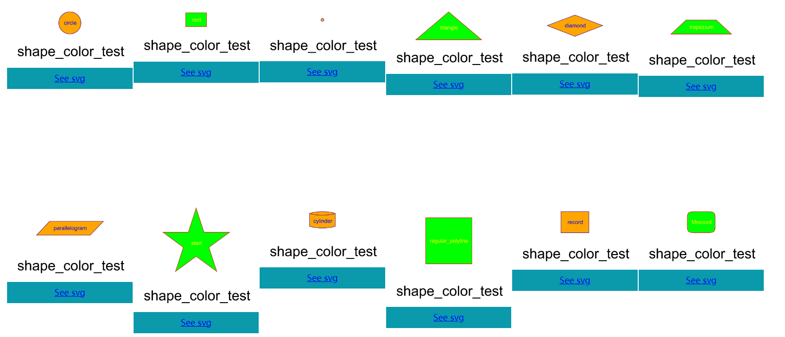

# graph-support

**graph-support** is a minimalistic re-implementation of a **Graphviz** using pure Java, almost without external dependencies. It is designed to be small and efficient, and provides a Java API similar to dot-script.

Key Features:

* API like Dot-script structure

* No external dependencies

* Lightweight and efficient

Target Audience: 

Developers who need to work with **Graphviz** in their Java applications, but want a small and efficient solution without relying on external libraries.

## How to build

You require the following to build **graph-support**:

- Latest stable [OpenJDK 8](https://adoptium.net/)
- Latest stable [Apache Maven](https://maven.apache.org/)

Run the following command under the current project:

```bash
mvn clean install
```

After building, go to `target/test-classes/visual/graph-visual.html` to see all the visual test cases.


## Usage

### Import

This project is available via Maven:

```xml
<dependency>
    <groupId>org.graphper</groupId>
    <artifactId>graph-support</artifactId>
    <version>1.1.3</version>
</dependency>
```

### API like Dot-script

An API with a structure like a dot script, if you have written dot, it is easy to think of how to convert it into the corresponding java code:

```dot
digraph Q {
  // Node attribute template
  node [shape=rect];

  // Node definition
  nd_1   [label = "Node 1"];
  nd_2   [label = "Node 2"];
  nd_3_a [label = "Above Right Node 3"];
  nd_3_l [label = "Left of Node 3"];
  nd_3   [label = "Node 3"];
  nd_3_r [label = "Right of Node 3"];
  nd_4   [label = "Node 4"];

  // Edges in root graph
  nd_3_a -> nd_3_r;
  nd_1 -> nd_2 -> nd_3 -> nd_4;

  // Use Cluster to wrap the corresponding nodes and edges
  subgraph cluster_R {
    // Edge attribute template
    edge[color=grey arrowhead=none]
    // Use Subgraph to limit nodes to the same level
    {
        rank=same 
        nd_3_l
        nd_3 
        nd_3_r
    }

    // Edges in cluster
    nd_3_l -> nd_3 -> nd_3_r;
  }
}
```

The Java code of a similar structure is as follows: 

```java
// Node definition
Node nd_1 = Node.builder().label("Node 1").build();
Node nd_2 = Node.builder().label("Node 2").build();
Node nd_3_a = Node.builder().label("Above Right Node 3").build();
Node nd_3_l = Node.builder().label("Left of Node 3").build();
Node nd_3 = Node.builder().label("Node 3").build();
Node nd_3_r = Node.builder().label("Right of Node 3").build();
Node nd_4 = Node.builder().label("Node 4").build();

Graphviz graphviz = Graphviz.digraph()
    // Node attribute template
    .tempNode(Node.builder().shape(NodeShapeEnum.RECT).build())
    // Edges in root graph
    .addLine(nd_3_a, nd_3_r)
    .addLine(nd_1, nd_2, nd_3, nd_4)
    // Use Cluster to wrap the corresponding nodes and edges
    .cluster(
        Cluster.builder()
            // Edge attribute template
            .tempLine(Line.tempLine().color(Color.GREY).arrowHead(ArrowShape.NONE).build())
            // Use Subgraph to limit nodes to the same level
            .subgraph(
                Subgraph.builder()
                    .rank(Rank.SAME)
                    .addNode(nd_3_l, nd_3, nd_3_r)
                    .build()
            )
            // Edges in cluster
            .addLine(nd_3_l, nd_3, nd_3_r)
            .build()
    )
    .build();

// Print svg
System.out.println(graphviz.toSvgStr());
```

### Node shape example



### Record node example

```java
Graphviz graphviz = Graphviz.digraph()
    .tempNode(Node.builder().shape(NodeShapeEnum.RECORD).build())
    // Using startClus and endClus has the same effect as "cluster(Cluster.builder().build())"
    .startClus()
    .margin(1.5, 0.2)
    .label("Without align cell in horizontal and vertical")
    .addNode(
        Node.builder().label(
                "{{Name|Sex|Age}|{Michael|Men|15}|{Abigail|Female|18}}")
            .build()
    )
    .endClus()

    .startClus()
    .margin(1.5, 0.2)
    .label("Use '#' to align cell in horizontal and vertical")
    .addNode(
        Node.builder().label(
                "# {{Name|Sex|Age}|{Michael|Men|15}|{Abigail|Female|18}}")
            .build()
    )
    .endClus()
    .build();
```


### Table and Assemble

**Table** provides the html table layout of Cells, and **Assemble** is an original way of splicing Cells. Here is an example of drawing the same graph using both methods:

```java
    Node table = Node.builder()
        .table(
            table().cellSpacing(4)
                .tr(
                    td().bgColor(Color.RED),
                    td().text("Create By\nTable"),
                    td().bgColor(Color.BLUE)
                )
        )
        .build();

    Node assemble = Node.builder()
        .assemble(
            Assemble.builder()
                .width(1.6)
                .height(0.6)
        		// Left Cell
                .addCell(0.05, 0.05,// Offset
                         Node.builder()
                             .width(0.1)
                             .height(0.5)
                             .fillColor(Color.RED)
                             .build())
        		// Middle cell
                .addCell(0.2, 0.05,// Offset
                         Node.builder()
                             .width(1)
                             .height(0.5)
                             .fontSize(12)
                             .label("Create by \nAssemble")
                             .build())
        		// Right cell
                .addCell(1.25, 0.05,// Offset
                         Node.builder()
                             .width(0.1)
                             .height(0.5)
                             .fillColor(Color.BLUE)
                             .build())
                .addCell(0, 0,
                         Node.builder()
                             .width(1.4)
                             .height(0.6)
                             .build())
                .build()
        )
        .build();

    Graphviz.digraph()
        .tempNode(Node.builder().shape(NodeShapeEnum.PLAIN).build())
        .addNode(table, assemble)
        .build();
```


*Some table example:*


### Edge router example


### Edge router debug attribute

Some properties can be used to debug edge router:

#### Show control points


#### Show edge router boxes


#### Show grid in ORTHO


### Edge Port


### Use layout engine

If you only want to use the layout engine to calculate the coordinates of nodes and the position of line segments, the following is a simple example:

```java
Node a = Node.builder().label("a").build();
Node b = Node.builder().label("b").build();
Graphviz graphviz = Graphviz.digraph()
    .addLine(a, b)
    .build();

// Use the layout engine directly, skip graph rendering
DrawGraph drawGraph = Layout.DOT.getLayoutEngine().layout(graphviz);

for (NodeDrawProp node : drawGraph.nodes()) {
  // The node coordinate
  double x = node.getX();
  double y = node.getX();

  // Set the coordinates into your own program
}

for (LineDrawProp line : drawGraph.lines()) {
  // all points of the line segment
  for (FlatPoint point : line) {
    // If the line is a curve, every group of four points forms a two-stage Bezier curve, 
    // and every two adjacent Bezier curves share one point
    if (line.isBesselCurve()) {
    } else {
    }
  }
}

```

## Contributing

We welcome all developers to contribute to the project. If you're interested in contributing code, here are some areas where we'd love to do more work:

- Add more node and arrow shapes to the library;
- Implement basic styling for additional elements in the graph;
- Build a dot script parser that maps to the graph-support API;
- Create new line routing or node layout algorithms to enhance the library.

Please feel free to contribute in any way you feel comfortable, and thank you for your interest in our project!
